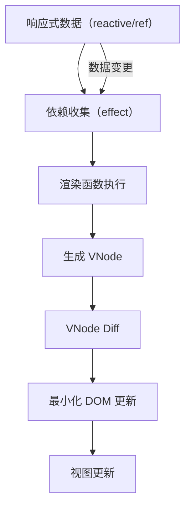
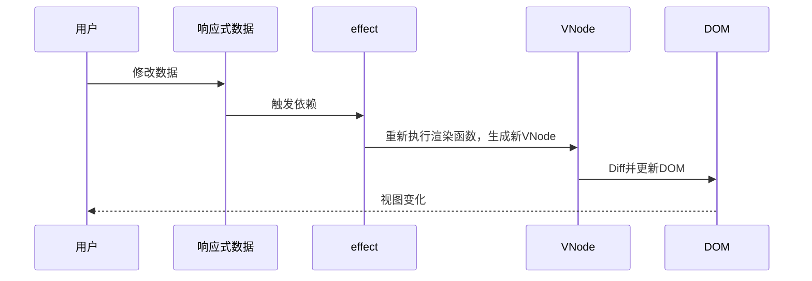
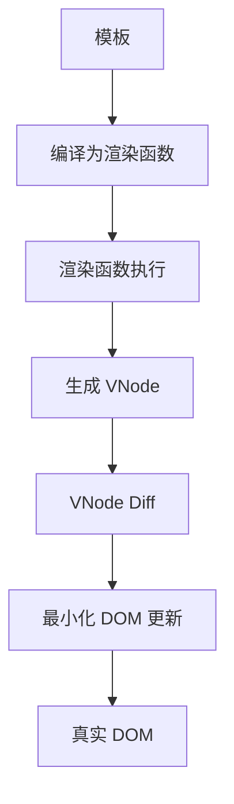

# 前言

Vue3 作为现代前端框架的代表，其响应式系统和渲染机制是其高效、易用的核心。本文将深入剖析 Vue3 的响应式原理、渲染机制，并探讨两者之间的关系，帮助你更好地理解 Vue3 的底层实现与性能优化思路。

> **阅读指引**：本文内容丰富，建议收藏后细读。配有大量流程图、结构图和源码分析，适合进阶前端开发者。

---

## 目录
1. [前言](#前言)
2. [响应式系统原理](#一vue3-响应式原理)
3. [渲染机制](#二vue3-渲染机制)
4. [响应式与渲染的关系](#三响应式与渲染的关系)
5. [实战与最佳实践](#五实战与最佳实践)
6. [总结与思考](#六总结与思考)

---

## 一、Vue3 响应式原理

### 1.1 响应式系统的目标

响应式系统的核心目标是：**数据变化时，自动驱动视图更新**。开发者只需专注于数据本身，无需手动操作 DOM。


*图1：响应式系统的目标——数据驱动视图*

### 1.2 Proxy 与响应式对象

Vue3 使用 ES6 的 `Proxy` 替代了 Vue2 的 `Object.defineProperty`，实现了更彻底、灵活的响应式。

```js
import { reactive } from 'vue'
const state = reactive({ count: 0 })
state.count++ // 视图自动更新
```

#### Proxy 的作用
- **拦截对象的读取和设置**：通过 `get` 和 `set` 捕获属性访问和修改。
- **深度响应式**：无需递归地为每个属性设置 getter/setter，天然支持嵌套对象。
- **数组、Map、Set 等原生支持**：相比 Vue2，Proxy 能直接代理这些复杂类型。

#### Proxy 响应式结构图


*图2：Proxy 拦截对象属性，实现深度响应式*

### 1.3 依赖收集与触发更新

响应式的核心机制是"依赖收集"和"依赖触发"。

- **依赖收集**：在组件渲染或计算属性执行时，读取响应式数据，Vue 会记录当前依赖于该数据的副作用（effect）。
- **依赖触发**：当响应式数据发生变化时，通知所有依赖于该数据的副作用重新执行。

#### 响应式依赖收集流程图



#### 简化源码示例

```js
let activeEffect = null
function effect(fn) {
  activeEffect = fn
  fn()
  activeEffect = null
}

const bucket = new WeakMap()
const data = { text: 'hello' }
const obj = new Proxy(data, {
  get(target, key) {
    if (activeEffect) {
      let depsMap = bucket.get(target)
      if (!depsMap) bucket.set(target, (depsMap = new Map()))
      let deps = depsMap.get(key)
      if (!deps) depsMap.set(key, (deps = new Set()))
      deps.add(activeEffect)
    }
    return target[key]
  },
  set(target, key, newVal) {
    target[key] = newVal
    const depsMap = bucket.get(target)
    if (!depsMap) return
    const effects = depsMap.get(key)
    effects && effects.forEach(fn => fn())
    return true
  }
})
```

#### 依赖收集时序图



### 1.4 计算属性与侦听器

- **计算属性（computed）**：基于响应式依赖自动缓存和更新。
- **侦听器（watch）**：监听响应式数据变化，执行副作用逻辑。

#### computed 示例

```js
import { computed, reactive } from 'vue'
const state = reactive({ count: 1 })
const double = computed(() => state.count * 2)
```

computed 内部本质上也是 effect，只不过有缓存和脏检查机制。

#### watch 示例

```js
import { watch, reactive } from 'vue'
const state = reactive({ count: 1 })
watch(() => state.count, (newVal, oldVal) => {
  console.log('count changed:', newVal, oldVal)
})
```

### 1.5 响应式陷阱与边界

- 只有通过 `reactive`、`ref` 等 API 创建的数据才具备响应式能力。
- 非响应式数据变化不会触发视图更新。
- 不要直接操作响应式对象的原始值（如 ref 的 .value）。
- 响应式丢失：解构赋值、JSON 序列化等会丢失响应式。

### 1.6 Vue2 与 Vue3 响应式对比

| 特性 | Vue2 | Vue3 |
|---|---|---|
| 响应式实现 | Object.defineProperty | Proxy |
| 深度监听 | 需递归 | 天然支持 |
| 新增/删除属性 | 需 Vue.set/delete | 直接支持 |
| 数组/Map/Set | 支持有限 | 原生支持 |
| 性能 | 大型对象性能瓶颈 | 更优 |

### 1.7 与 React 响应式机制对比

- React 采用不可变数据+手动 setState，依赖虚拟 DOM diff。
- Vue3 响应式是自动依赖收集+精细追踪，减少无效渲染。
- React 18 引入 signals，理念逐渐靠近 Vue3。

---

## 二、Vue3 渲染机制

### 2.1 虚拟 DOM（VNode）

Vue3 采用虚拟 DOM（VNode）作为视图的中间表示。

- **VNode 是对真实 DOM 的抽象**，便于高效比较和批量更新。
- 每次数据变化后，Vue 会重新生成新的 VNode 树，与旧的 VNode 树进行对比（diff），只更新实际变化的部分。


*图3：VNode 结构示意*

### 2.2 渲染流程

1. **模板编译**：模板被编译为渲染函数（render function）。
2. **渲染函数执行**：读取响应式数据，生成 VNode。
3. **VNode diff**：新旧 VNode 树对比，找出变化。
4. **最小化 DOM 更新**：只对变化的部分进行 DOM 操作。

#### 渲染流程全景图



### 2.3 VNode Diff 算法详解

- Vue3 采用双端对比、最长递增子序列等优化算法，提升 diff 性能。
- 只对变化的节点进行最小化 patch。
- 支持 Fragment、Teleport、Suspense 等高级特性。

#### Diff 算法伪代码

```js
function patch(n1, n2, container) {
  if (n1.type !== n2.type) {
    // 替换整个节点
    replaceNode(n1, n2, container)
  } else {
    // 递归对比子节点
    patchChildren(n1.children, n2.children, container)
    // 更新属性
    patchProps(n1.props, n2.props, container)
  }
}
```

### 2.4 批量异步更新与性能优化

- **批量异步更新**：多次数据变更会被合并，在同一个事件循环中只触发一次 DOM 更新。
- **静态提升、事件缓存**：编译阶段优化，减少运行时开销。
- **长列表优化**：key 的合理使用，避免不必要的重排。

### 2.5 静态提升与事件缓存

- 静态节点只生成一次，运行时直接复用。
- 事件处理函数缓存，避免重复绑定。

---

## 三、响应式与渲染的关系

### 3.1 响应式如何驱动渲染

- 组件渲染时，会读取响应式数据，自动建立依赖。
- 当响应式数据变化时，相关的副作用（如渲染函数）会被重新执行，生成新的 VNode，触发视图更新。

### 3.2 依赖追踪与最小化更新

- Vue3 精确追踪每个组件、每个属性的依赖，只有依赖的数据变化时才会重新渲染。
- 通过 VNode diff，进一步减少 DOM 操作，提升性能。

### 3.3 性能瓶颈与优化建议

- 避免在响应式数据中存放大对象或频繁变动的数据。
- 合理拆分组件，减少无关依赖。
- 使用 computed、watchEffect 优化依赖追踪。
- 利用 keep-alive、v-memo 等高级特性。

---

## 四、实战与最佳实践

### 4.1 复杂场景下的响应式陷阱

- 解构赋值丢失响应式：

  ```js
  const { count } = reactive({ count: 1 })
  // count 不是响应式
  ```

- JSON 序列化丢失响应式：

  ```js
  const state = reactive({ a: 1 })
  JSON.parse(JSON.stringify(state)) // 结果不是响应式
  ```

- ref 的 .value 忘记访问：

  ```js
  const num = ref(1)
  console.log(num) // Proxy 对象
  console.log(num.value) // 1
  ```

### 4.2 性能调优案例

- 大型表格、长列表建议使用虚拟滚动。
- 频繁变动数据建议用 shallowReactive、markRaw。
- 事件节流、防抖，减少无效渲染。

### 4.3 响应式调试技巧

- 使用 Vue Devtools 检查依赖追踪。
- 利用 effect、watchEffect 手动追踪依赖。
- 打印依赖收集、触发日志，定位性能瓶颈。

---

## 五、总结与思考

Vue3 的响应式系统和渲染机制相辅相成，共同实现了高效、自动化的视图更新。理解其底层原理，有助于我们编写更高效、可维护的前端代码。

- **响应式系统**：负责追踪数据依赖，驱动副作用执行。
- **渲染机制**：负责将数据变化高效映射到真实 DOM。
- **两者关系**：响应式系统感知数据变化，渲染机制负责视图更新。

希望本文能帮助你深入理解 Vue3 的核心机制，写出更优雅的代码！

---

> **参考资料**：
> - Vue3 官方文档
> - Evan You 相关演讲与源码
> - 《Vue.js 设计与实现》
> - Vue3 源码 github.com/vuejs/core
> - React 官方文档
